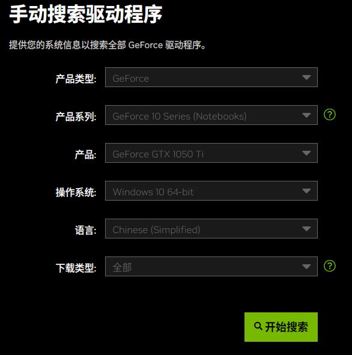
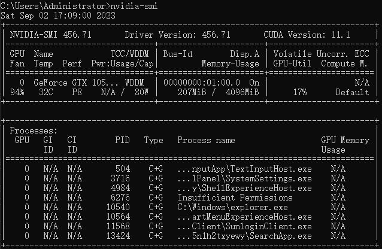
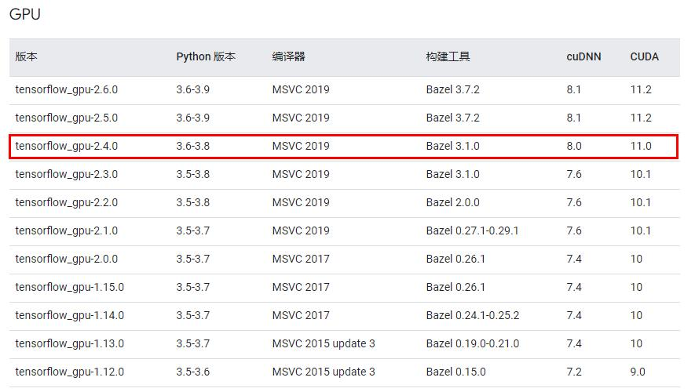
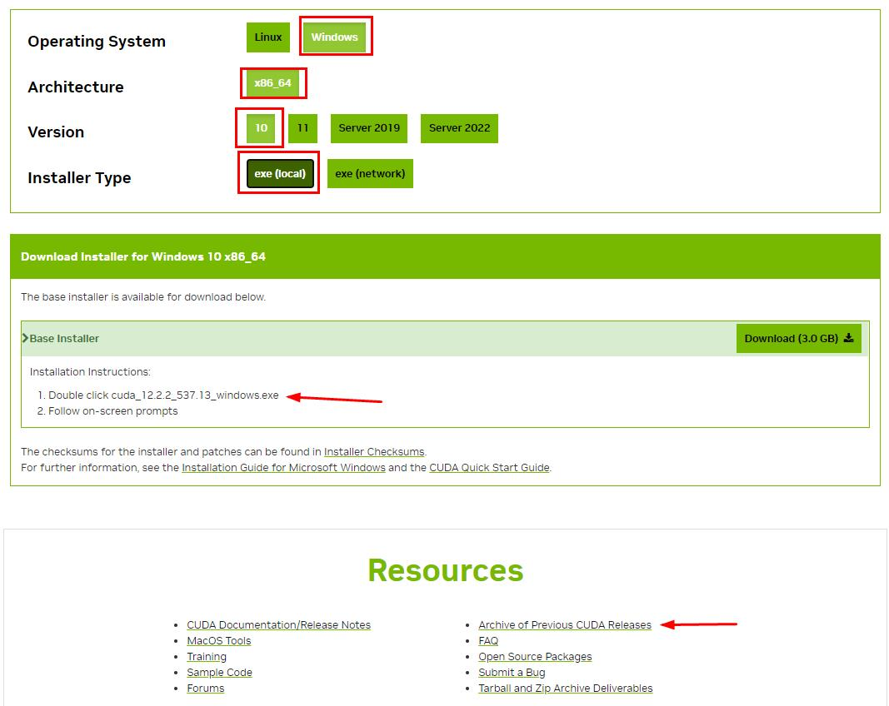
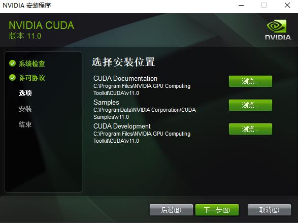

### 1、为什么要用GPU

在运行一些小模型和微调预训练模型的时候，可以不需要GPU，但是在使用 PyTorch 和 TensorFlow 创建模型和训练的时候就需要GPU来参与运算，在运行大语言模型的时候也需要GPU。

GPU (Graphics Processing Unit ) 是图形处理单元 ，是显卡的处理器，GPU设计出来就是并行计算二维矩阵的，GPU 的逻辑运算单元(ALU)小而多，控制器功能简单，缓存(cache)也较少。而CPU逻辑运算单元(ALU)较少，控制器(control)占比较大。

显卡的作用是显示运算图形，但是显卡内部的GPU可以用来计算，一般的显卡内存也就2G，远远不够，NVIDIA有专门用来计算的算力显卡，所以对显卡的要求既要算力达标，也要显存够用。

在并行计算方面，CPU一般也就8个，16个核心，而GPU可能有数千个，算力完全不在一个量级。


### 2、查看显卡信息

NVIDIA GPU 算力查询：https://developer.nvidia.com/cuda-gpus  比如点击 [CUDA-Enabled GeForce and TITAN Products](https://developer.nvidia.com/cuda-gpus#collapse4) 找到自己GPU的型号，Compute Capability 就是算力

下载 TechPowerUp GPU-Z 软件 https://www.techpowerup.com/download/，运行后如下


综上所述，本机显卡 `NVIDIA GeForce GTX 1050 Ti`，算力 6.1，内存 4G，支持CUDA，驱动版本可见图中的 Driver Version = 456.71，拥有768个cuda核心。

`ROPs / TMUs`：32 / 48 ，光栅化处理单元 和 纹理处理单元 的数量。

`shaders`：768 unified，通用着色器的数量，unified为通用的意思，早期的显卡有专门的顶点着色器单元，片元着色器单元，后来被设计成通用的单元，不再区分，同时，这些通用的单元还能提供一些通用的计算能力，称为算力单元。开发过OpenGL就会对这两个着色器非常了解，使用GLSL语言来编写着色器就会知道GPU在矩阵运算方面的强大。当然，几乎所有的显卡都支持OpenGL，但是只有NVIDIA显卡支持使用CUDA来调用 unified shaders 进行运算。

CUDA要求的最低算力是 3.7

### 3、安装 CUDA，cuDNN

环境 `win10, 64bit, python-3.8.8, tensorflow-2.4.0, pytorch-2.0.1`

CUDA（Compute Unified Device Architecture），是显卡厂商NVIDIA推出的运算平台。 CUDA™是一种由NVIDIA推出的通用并行计算架构，该架构使GPU能够解决复杂的计算问题。 它包含了CUDA指令集架构（ISA）以及GPU内部的并行计算引擎。 开发人员可以使用C语言来为CUDA™架构编写程序，所编写出的程序可以在支持CUDA™的处理器上以超高性能运行。CUDA3.0已经开始支持C++和FORTRAN。

通俗的将就是用显卡进行计算需要的一个程序框架，不同版本的显卡驱动支持的CUDA版本也不一样。

如果需要更新显卡驱动可参考官网：https://www.nvidia.cn/geforce/drivers/



下面会列出搜索结果，选择最新的下载安装即可，


查看 cuda driver 版本，命令 nvidia-smi




查看 tensorflow + python + cuDNN + CUDA 版本依赖关系：https://tensorflow.google.cn/install/source_windows#gpu



下载安装 CUDA：[https://developer.nvidia.com/cuda-downloads](https://developer.nvidia.com/cuda-downloads)，根据你的操作系统选择，如下



可见最新版本是`cuda_12.2.2_537.13_windows`，并不是我们想要的，点击下方的 [Archive of Previous CUDA Releases](https://developer.nvidia.com/cuda-toolkit-archive)，找到 [CUDA Toolkit 11.0.3](https://developer.nvidia.com/cuda-11-0-3-download-archive)，居然有2.7G

安装的时候，解压路径可以设置，此处为`D:\CUDA`，但是后面的安装路径最好不设置，选择自定义安装，不需要安装组件`NVIDIA GeForce Experience co...`。



安装完之后，打开命令行输入
```bash
> nvcc -V

nvcc: NVIDIA (R) Cuda compiler driver
Copyright (c) 2005-2020 NVIDIA Corporation
Built on Wed_Jul_22_19:09:35_Pacific_Daylight_Time_2020
Cuda compilation tools, release 11.0, V11.0.221
Build cuda_11.0_bu.relgpu_drvr445TC445_37.28845127_0
```

下载安装 cuDNN：[https://developer.nvidia.com//rdp/cudnn-archive](https://developer.nvidia.com//rdp/cudnn-archive)，找到 [Download cuDNN v8.0.5 (November 9th, 2020), for CUDA 11.0](https://developer.nvidia.com//rdp/cudnn-archive#a-collapse805-110)

大小 482M

下载完成后，将这个压缩包里的`bin, include, lib`目录下的文件分别复制到CUDA安装目录相应文件夹下合并之。

cuDNN（CUDA Deep Neural Network），是用于深度神经网络的GPU加速库，使CUDA更符合深度神经网络的使用，如果你不是开发深度神经网络应用，只安装CUDA来调用GPU即可，如果开发神经网络，那么使用cuDNN要比使用CUDD快1倍左右，所以在安装cuDNN的时候我们就是简单的合并了CUDA的文件。

配置完成后，我们可以验证是否配置成功，主要使用CUDA内置的测试文件，打开命令行，进入目录 `C:\Program Files\NVIDIA GPU Computing Toolkit\CUDA\v10.1\extras\demo_suite`，依次运行 `bandwidthTest.exe`和`deviceQuery.exe`

### 4、查看显卡有多少个核心

```python
from numba import cuda

# 不同的算力时，每个流多处理器SM拥有的核心数量
cc_cores_per_SM_dict = {
    (2,0) : 32,
    (2,1) : 48,
    (3,0) : 192,
    (3,5) : 192,
    (3,7) : 192,
    (5,0) : 128,
    (5,2) : 128,
    (6,0) : 64,
    (6,1) : 128,
    (7,0) : 64,
    (7,5) : 64,
    (8,0) : 64,
    (8,6) : 128
    }
d = cuda.get_current_device()
my_sms = getattr(d, 'MULTIPROCESSOR_COUNT') # 流多处理器SM的数量 6
my_cc = getattr(d, 'compute_capability') # 得到算力值 6.1
cores_per_sm = cc_cores_per_SM_dict.get(my_cc)
total_cores = cores_per_sm * my_sms # 768
```


参考 https://blog.csdn.net/l1158513573/article/details/122121634

